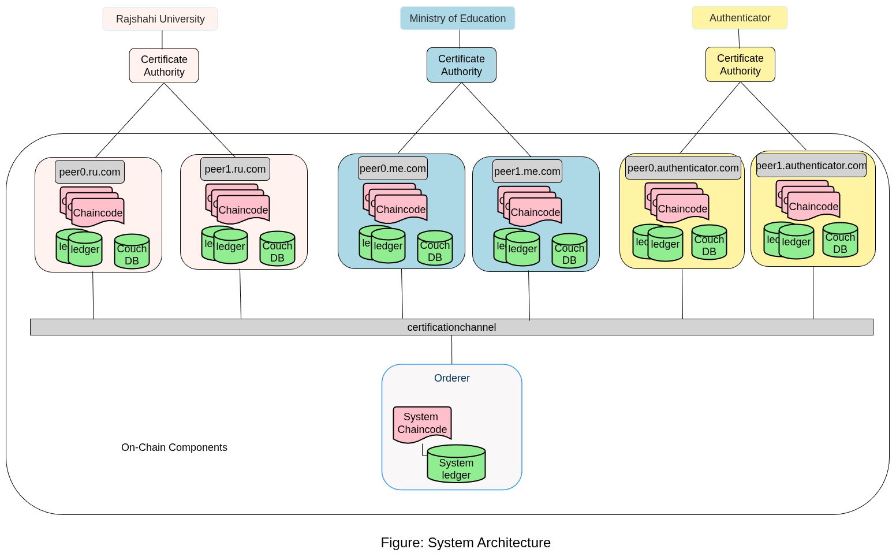

# Certificate Verification Network

The **Certificate Verification Network** is a blockchain-based system designed to ensure secure, tamper-proof issuance and verification of academic certificates. It provides a transparent and trusted way for universities, regulators, and employers (authenticators) to interact.

## Organizations

* **RU (Rajshahi University)** → Issues certificates to students after course completion.
* **ME (Ministry of Education)** → Regulator that audits and monitors all certificates and verifications.
* **Authenticator** → Verifies certificates before accepting them for employment or other purposes.

## Workflow

1. **Student Sign-up** → When a student enrolls at RU, their details are recorded on the blockchain.
2. **Certificate Issuance** → After completing the degree, RU issues a digital certificate stored immutably on the blockchain.
3. **Verification** → An authenticator checks the certificate against the blockchain to ensure it hasn’t been tampered with.
4. **Audit** → ME can view and audit all certificates and verification activities to ensure transparency.

## Smart Contract Functions

* **Create Student Account** → Register a new student on the network.
* **Get Student Details** → Retrieve student account information.
* **Issue Certificate** → Issue and record a student’s certificate on the blockchain.
* **Verify Certificate** → Validate a certificate’s authenticity using hash comparison.

## Tech Stack

* **Backend** → Node.js (Express) REST APIs
* **Blockchain** → Hyperledger Fabric Smart Contracts
* **Containerization** → Docker

---

With this system, certificates become **tamper-proof, easily verifiable, and transparent**, eliminating the risk of fraud and ensuring trust across the education ecosystem.



## 📂 Project Structure  

The project is organized into three main components:  

---

### 1. **network/**  
Contains all files related to setting up and running the Hyperledger Fabric network.  

- **Channel-artifacts/**  
- **crypto-config/**  
- **docker-base/**  
  - `docker-compose-base.yaml`  
  - `docker-compose-peer.yaml`  
- **scripts/** → Scripts to interact with the Fabric network  
  - `bootstrap.sh`  
  - `installChaincode.sh`  
  - `updateChaincode.sh`  
  - `utils.sh`  
- `configtx.yaml`  
- `crypto-config.yaml`  
- `docker-compose-e2e.yml`  
- `docker-compose-template.yaml`  
- `docker-compose.yaml`  
- `fabricNetwork.sh`  

---

### 2. **chaincode-go/**  
Contains the smart contract code.  

- `certnet.go` → Smart contract logic  
- `go.mod`
- `go.sum`
- `vendor/`  

---

### 3. **application/**  
Contains the backend APIs and frontend client application.  

- `1_addToWallet.js`  
- `2_createStudents.js`  
- `3_getStudents.js`  
- `4_issueCertificate.js`  
- `5_verifyCertificate.js`  
- `contractHelper.js`  
- `index.js`  
- `connection-profile-mhrd.yaml`  
- `package-lock.json`  
- `package.json`  

- Client/ 

---

---

## 🚀 Setup & Deployment Guide

Follow the steps below to set up and run the **Certificate Verification Network**.

---

### 1️⃣ Start the Blockchain Network

```bash
cd network
./fabricNetwork.sh down        # Stop any existing network
./fabricNetwork.sh generate    # Generate crypto material & configs
./fabricNetwork.sh up          # Start the Fabric network
```

---

### 2️⃣ Install Application Dependencies

```bash
cd ../application
npm install
```

---

### 3️⃣ Set Permissions for Scripts

```bash
cd ../network
chmod +x scripts/deployCertNet.sh
chmod +x scripts/bootstrap.sh
chmod +x scripts/envVar.sh
```

---

### 4️⃣ Prepare Chaincode

```bash
cd ../chaincode-go
go mod init github.com/chaincode
go mod tidy
go mod vendor
```

---

### 5️⃣ Deploy the Smart Contract

```bash
cd ../network
./fabricNetwork.sh deploy
```

---

### 6️⃣ Setup Application Wallet
#### Location: **application/**

* ⚠️ Delete existing identities before adding new ones

	```bash
	rm -rf ./identity
	```

* Add admin identity to wallet:

	```bash
	node 1_addToWallet.js
	```


* Create a new student account:

  ```bash
  node 2_createStudent.js
  ```

* Issue a certificate:

  ```bash
  node 4_issueCertificate.js
  ```

* Verify a certificate:

  ```bash
  node 5_verifyCertificate.js
  ```

---

✅ Your **Certificate Verification Network** is now running with RU, ME, and Authenticator roles.
